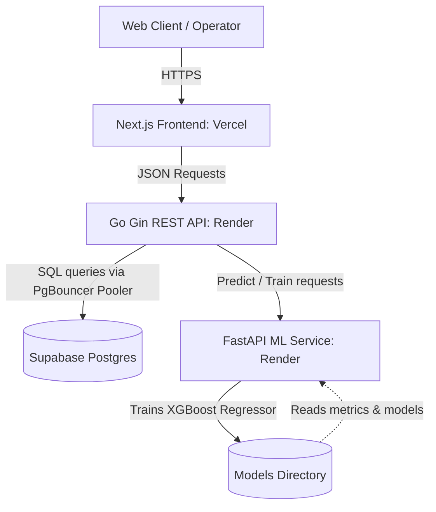

# BawarchiAI 🍲 — Zero-Waste Canteen Planner

BawarchiAI is an end-to-end, production-grade AI platform designed to minimize food waste in canteens and institutional kitchens. By blending machine learning predictions with historical baseline telemetry, the platform optimizes preparation quantities, registers leftover surplus, and routes surplus food to local NGOs.

### 🔗 Live URLs
* **Live Web App**: [https://bawarchi-ai-rust.vercel.app](https://bawarchi-ai-rust.vercel.app)
* **Go Backend Server API**: [https://bawarchiai-backend.onrender.com](https://bawarchiai-backend.onrender.com)
* **Python FastAPI ML Service**: [https://bawarchiai-ml.onrender.com](https://bawarchiai-ml.onrender.com)

---

## 📈 System Metrics & Performance

* **In-Sample Model Fit ($R^2$)**: **`99.92%`** (MAE = `1.17 kg` | RMSE = `1.53 kg`)
* **Out-of-Sample Generalization (5-Fold Cross-Validation $R^2$)**: **`97.88%`** (MAE = `5.70 kg` | RMSE = `7.65 kg`)
* **Inference Latency**: **`<350ms`** (hybrid forecast evaluation)
* **Ecological & Operational Impact**:
  * **Food Saved**: `5,698 kg` (includes 15% AI-prevented waste + NGO redistribution)
  * **Meals Redistributed**: `22,793 meals` (standardized 250g portion size)
  * **$CO_2$ Emissions Prevented**: `13,106 kg` (EPA/WRI conversion factor of 2.3x)

---

## 🏗️ Architecture & Data Flow



### 1. Hybrid Forecasting Engine
The ML service uses a blended forecasting algorithm to combine statistical averages with predictive regressor weights:
$$\text{Expected Consumption} = 0.7 \times \text{XGBoost Prediction} + 0.3 \times \text{Historical Canteen Average}$$

Recommendations are scaled using **Confidence Multipliers** based on historical sample support ($N$) and Coefficient of Variation ($CV = \sigma / \mu$):
* **High Confidence** ($N \ge 20$, $CV < 0.15$): **`1.05x`** safety buffer.
* **Medium Confidence** ($N \ge 8$, $CV < 0.30$): **`1.10x`** safety buffer.
* **Low Confidence** (Fallback): **`1.18x`** safety buffer (prevents student shortages).

---

## 🛠️ Technology Stack

| Component | Technology | Description |
| :--- | :--- | :--- |
| **Frontend** | TypeScript, Next.js 15, TailwindCSS, Recharts | Dynamic dashboards, Recharts feature importances, and NGO logs |
| **Backend** | Go (Golang), Gin Gonic, pgx/v5 | REST API, database connection pooler, middleware CORS routing |
| **ML Service** | Python 3.10+, FastAPI, XGBoost, Pandas, Scikit-Learn | Training pipeline, 5-Fold Cross-Validation, Feature Importances |
| **Database** | PostgreSQL (Supabase), PgBouncer | Serverless SQL hosting, transaction pooling using Simple Protocol |
| **Infrastructure** | Docker, Docker Compose, GitHub Actions | Multi-container local orchestration and CI/CD triggers |

---

## 📂 Project Structure

```text
├── backend/               # Go REST API Server
│   ├── cmd/server/        # Entry point (main.go)
│   ├── internal/          # Core modules (forecast, surplus, impact, donation)
│   └── Dockerfile
├── frontend/              # Next.js App Router Frontend
│   ├── app/               # React Page Views & Layouts
│   ├── components/        # Redesigned Green Zero-Waste Components
│   └── lib/api.ts         # Non-cached API client fetching
├── ml-service/            # Python FastAPI Machine Learning service
│   ├── app/               # Models training, encoders, features preprocessing
│   └── Dockerfile
└── docker-compose.yml     # Local orchestration stack
```

---

## ⚡ Local Setup

### 1. Prerequisite
* Install [Docker](https://www.docker.com/) and [Docker Compose](https://docs.docker.com/compose/).

### 2. Launch Local Environment
Clone the repository and spin up the backend, database, and machine learning services:
```bash
git clone https://github.com/AkshajSonar/BAWARCHI.AI.git
cd BAWARCHI.AI
docker compose up --build -d
```

### 3. Seed Database & Train Model
In a separate terminal, seed the database with canteens training data and trigger model retraining:
```bash
# Seed local Postgres
docker exec -i bawarchiai-postgres-1 psql -U plateai -d plateai < path/to/seed.sql

# Trigger retraining on local Go server
curl -X POST http://localhost:8080/forecast/retrain
```

### 4. Run Frontend Development Server
Navigate to the frontend directory, install dependencies, and run Next.js:
```bash
cd frontend
npm install
npm run dev
```
Open [http://localhost:3000](http://localhost:3000) to view the application.
